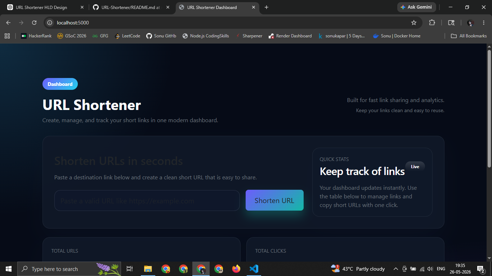
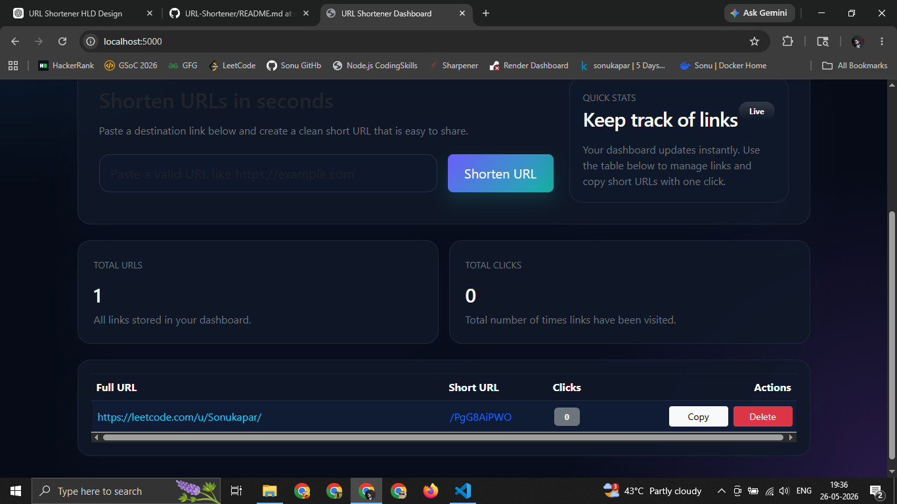
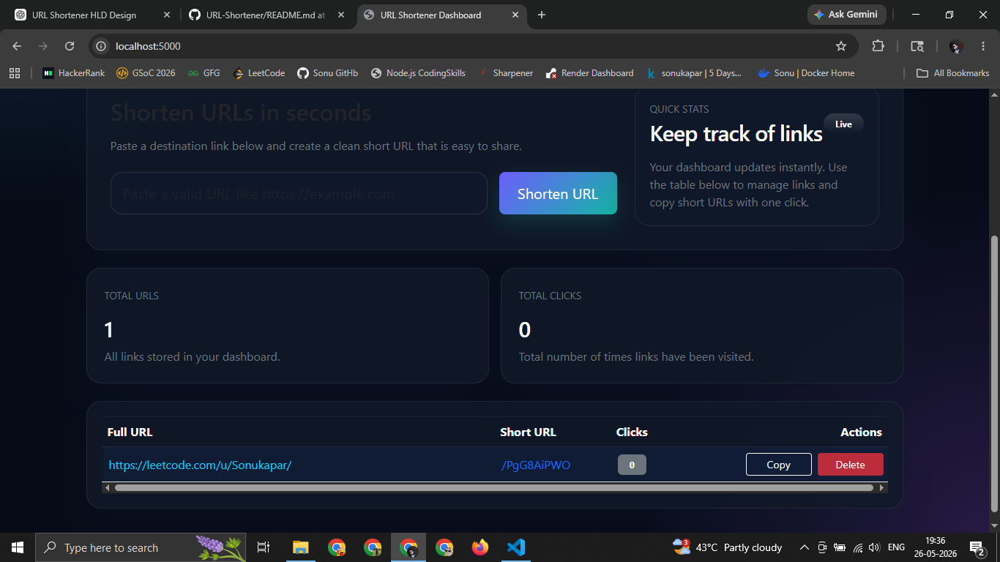
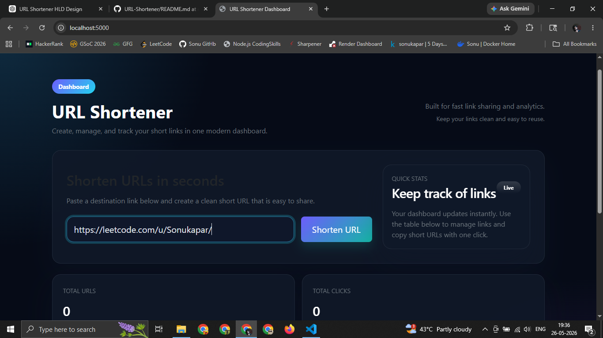

# URL Shortener

[](https://nodejs.org/)
[](https://reactjs.org/)
[](https://www.mongodb.com/)
[](LICENSE)
[](https://github.com/Sonukapar00/URL-Shortener/stargazers)

> Scalable URL Shortener System with analytics dashboard built using MERN stack principles.

## Project Overview

This repository showcases a professional URL shortener with a clean analytics dashboard. The service allows users to generate shareable short links, track click counts, and manage entries from a polished interface.

The repo is organized for recruiters with a modern project layout, clear documentation, and deployment-ready instructions.

## Features

- Generate short URLs from long destination links
- Preserve tracking history for each shortened link
- Copy short links to clipboard with one click
- Delete outdated or invalid URLs
- Server-side validation for secure URL creation
- MongoDB persistence for reliable storage
- Clean dashboard UI for active link management

## Tech Stack

- Node.js
- Express.js
- MongoDB / Mongoose
- EJS for dashboard rendering
- Bootstrap 5 for responsive layout
- dotenv for environment configuration

## Folder Structure

```
client/
server/
  controllers/
  routes/
  models/
  middlewares/
  config/
screenshots/
config/
```

## System Architecture

The application is designed with a scalable server-side architecture:

- **Routing layer** in `server/routes/`
- **Controller layer** in `server/controllers/`
- **Database models** in `server/models/`
- **Validation middleware** in `server/middlewares/`
- **Database configuration** in `server/config/`

This structure keeps business logic separate from delivery and makes the backend easier to extend into a frontend-first MERN application.

## Screenshots









## Installation

```bash
git clone https://github.com/Sonukapar00/URL-Shortener.git
cd URL-Shortener
npm install
cp .env.example .env
```

### Configure Environment

Update `.env` using the sample values below:

```env
PORT=5000
BASE_URL=http://localhost:5000
MONGO_URI=mongodb://127.0.0.1:27017/url-shortener
NODE_ENV=development
```

## Local Development

```bash
npm run dev
```

Open `http://localhost:5000` to access the dashboard.

## API Endpoints

- `GET /` — Dashboard view with current URLs
- `POST /shorturls` — Create a new short URL
- `GET /:shortCode` — Redirect to the original URL
- `POST /delete/:id` — Remove a short URL

### Example request body

```json
{
  "fullUrl": "https://example.com"
}
```

## Deployment

### Backend → Render

1. Create a new Web Service on Render.
2. Connect your GitHub repository.
3. Set the build command to `npm install` and the start command to `npm start`.
4. Add environment variables from `.env.example`.

### Frontend → Vercel

The repository is structured to support a future React frontend in the `client/` folder.

1. Deploy a new site on Vercel.
2. Connect the repository and select the `client/` folder.
3. Configure the app to point to the Render backend URL.

## Future Improvements

- Add authentication and user accounts
- Support custom short URL aliases
- Generate QR codes for each link
- Add Redis caching for performance
- Implement rate limiting and abuse protection
- Add analytics charts for click trends

## About

This repository is prepared for LinkedIn and resume showcase with professional documentation, clear architecture, and recruiter-friendly structure. It highlights scalable backend design and a polished management dashboard.

---

## Start Application

```bash
npm start
```

---

# Run Application

Open browser and visit:

```text
http://localhost:5000
```

---

# METHODOLOGY

The project follows a request-response communication model between the client and the server.

The browser sends requests to the backend server, the server processes the request, interacts with MongoDB, and sends the response back to the client.

The application demonstrates:
- URL shortening logic
- Database integration
- Backend routing
- Dynamic frontend rendering
- Click tracking functionality
- CRUD operations

---

# CONCLUSION

This project demonstrates the implementation of a functional URL shortening platform using Node.js, Express.js, MongoDB, and EJS.

The application provides URL shortening, URL management, redirection handling, and click analytics within a clean backend architecture.

The project also serves as a beginner-friendly system design and backend development project for understanding client-server communication and database-driven web applications.

---

# License

This project is licensed under the MIT License.

---

# Author

Sonu Kapar